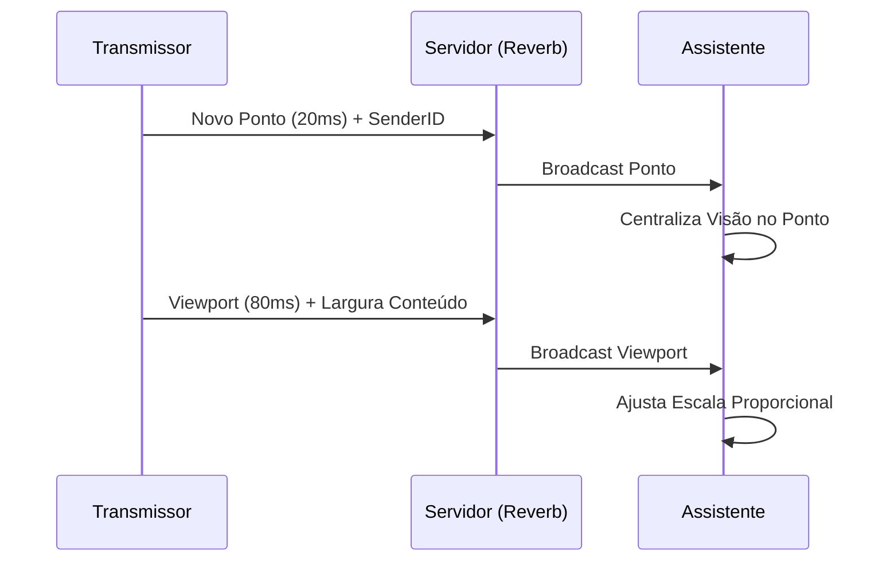

# Walkthrough: Foco no Conteúdo e Latência Ultra-Baixa

Aprimorámos a colaboração em tempo real com duas grandes melhorias: o modo **Foco no Conteúdo (Follow the Pen)** e a **Escala Adaptativa Proporcional**, além de reduzir drasticamente a latência.

## Principais Melhorias

### 🎯 Foco no Conteúdo (Follow the Pen)
Agora, quando assistes a um colega, a tua tela não apenas segue os movimentos de câmera dele, mas **foca-se automaticamente no que ele está a desenhar**.
- Sempre que o transmissor desenha um traço, a visão do assistente centraliza-se na ponta da caneta em tempo real.
- Isso garante que, mesmo que o transmissor esteja a desenhar num canto da folha que tu não verias normalmente, a aplicação "puxa" a tua visão para lá imediatamente.

### ⚖️ Escala Adaptativa Proporcional
Resolvemos o problema de "quem vê o quê" em telas de tamanhos diferentes (PC vs Telemóvel).
- O transmissor envia a **largura real do conteúdo** que está a ver.
- O seguidor calcula uma escala personalizada para que esse mesmo conteúdo preencha a largura da sua própria tela.
- **Resultado:** Se o transmissor vê a folha inteira, tu também vês a folha inteira, independentemente se estás num monitor gigante ou num smartphone pequeno.

### ⚡ Latência Reduzida
- **Traços:** Aumentámos a frequência de envio de pontos para **50 vezes por segundo (20ms)**. Os desenhos agora aparecem quase instantaneamente para os outros.
- **Câmera:** A sincronização de movimento foi acelerada para **80ms**, tornando o acompanhamento muito mais fluido.

## Como Testar

1. **Follow the Pen:** Peça a um colega para começar a transmitir e comece a assisti-lo. Peça-lhe para desenhar em diferentes partes da folha. A sua tela deve "voar" suavemente para centrar em cada novo traço.
2. **PC vs Mobile:** Abra o caderno num computador e num telemóvel. No telemóvel, assista ao computador. Redimensione a janela do navegador no PC; verá o telemóvel ajustar o zoom automaticamente para manter a paridade visual.

